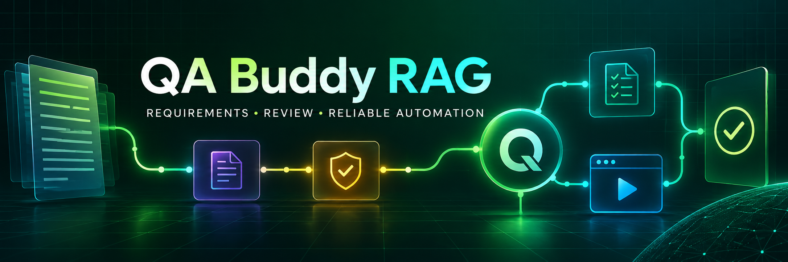

  

<h1 align="center">QA Buddy RAG</h1>

  An advanced, evidence-grounded QA agent that turns requirements into reviewed test design, executable browser automation, and traceable reports.

  
  
  
  
  

  <a href="#quick-start">Quick start</a> •
  <a href="#end-to-end-flow">Architecture</a> •
  <a href="#supported-ai-providers">AI providers</a> •
  <a href="#human-review-and-hard-gates">Review gates</a> •
  <a href="#deployment">Deploy</a>

> The current Vercel preview is available at <a href="https://temporary-instant-walnut-pq3jq6q.vercel.app/">temporary-instant-walnut-pq3jq6q.vercel.app</a>. Use the deployment section below to create a permanent deployment under your own Vercel account.

## What QA Buddy RAG does

QA Buddy RAG combines two connected product surfaces:

1. A schema-first Python and LangGraph pipeline that ingests product requirements, retrieves grounded evidence from Chroma, identifies ambiguity, designs tests, pauses for human approval, generates browser automation, executes it, and packages traceability artifacts.
2. Quality Forge, a responsive React console for provider selection, live API-key verification, model discovery, requirement input, test-design review, human hard-gate approval, and automation output.

### Core capabilities

| Capability | What it provides |
|---|---|
| Requirement ingestion | Markdown, PDF, and DOCX parsing with normalized source evidence |
| Retrieval grounding | Chroma-backed chunks with deterministic hash embeddings or optional semantic embeddings |
| Structured generation | Pydantic and JSON Schema contracts for plans, strategies, scenarios, cases, and automation |
| Ambiguity detection | A clarification gate stops the pipeline when requirements do not support a safe test design |
| Human hard gate | Test cases must be explicitly approved before automation is generated |
| Multi-provider UI | Provider dropdown plus API-key-scoped model dropdown populated from the provider API |
| QA review workspace | Review tab, readiness state, requirement coverage, and approval controls |
| Automation | Playwright, Cucumber, TypeScript, and Allure output |
| Traceability | Requirement-to-scenario-to-test-to-execution lineage and evidence bundles |
| CI and deployment | GitHub Actions verification with optional Vercel production deployment |

## End-to-end flow

~~~mermaid
flowchart LR
    A[Requirement evidence Markdown PDF DOCX] --> B[Parse and normalize]
    B --> C[Chunk and index]
    C --> D[(Chroma retrieval store)]
    D --> E[Retrieve grounded context]
    E --> F[Selected AI provider and verified model]
    F --> G[Schema validation]
    G --> H{Ambiguity found?}
    H -- Yes --> I[Clarification gate]
    I --> E
    H -- No --> J[Test plan]
    J --> K[Test strategy]
    K --> L[Scenarios]
    L --> M[Test cases]
    M --> N{Human hard gate}
    N -- Changes requested --> J
    N -- Approved --> O[Generate automation]
    O --> P[TypeScript checks]
    P --> Q[Playwright and Cucumber]
    Q --> R[Allure and browser evidence]
    R --> S[Traceability report]
    S --> T[Vercel dashboard]

    classDef source fill:#083344,stroke:#22d3ee,color:#ecfeff
    classDef ai fill:#3b0764,stroke:#c084fc,color:#faf5ff
    classDef gate fill:#422006,stroke:#facc15,color:#fefce8
    classDef output fill:#052e16,stroke:#4ade80,color:#f0fdf4
    class A,B,C,D,E source
    class F,G,J,K,L,M ai
    class H,I,N gate
    class O,P,Q,R,S,T output
~~~

### Quality Forge interaction

~~~mermaid
sequenceDiagram
    actor QA as QA reviewer
    participant UI as React console
    participant API as Vercel API
    participant AI as AI provider

    QA->>UI: Choose provider family
    QA->>UI: Enter provider API key
    UI->>API: Verify key and request models
    API->>AI: Call provider model catalog
    AI-->>API: Account-accessible models
    API-->>UI: Filtered model dropdown
    QA->>UI: Select model and submit requirements
    UI->>API: Generate structured QA pipeline
    API->>AI: Provider-specific generation request
    AI-->>API: Structured response
    API-->>UI: Plan, strategy, cases, and coverage
    QA->>UI: Review results
    QA->>UI: Approve human hard gate
    UI->>API: Generate automation bundle
    API-->>UI: Traceable implementation output
~~~

## Supported AI providers

Quality Forge separates the provider and model choices. After the API key is validated against the selected provider, only compatible models available to that account appear in the model dropdown.

| UI option | Provider API | Model behavior |
|---|---|---|
| GPT | OpenAI | Shows compatible GPT and reasoning models returned for the key |
| Codex | OpenAI | Shows available models whose IDs belong to the Codex family |
| Claude | Anthropic | Shows compatible Anthropic generation models |
| Gemini | Google AI | Shows models supporting content generation |
| NVIDIA | NVIDIA NIM | Shows compatible hosted text-generation models |
| Groq | GroqCloud | Filters out transcription and guard-only models |
| Mistral | Mistral AI | Shows active chat-completion models |
| OpenRouter | OpenRouter | Shows text-output models after key verification |
| Offline mock | Local deterministic engine | Requires no key and is ideal for demos and CI |

The UI does not keep API keys in local storage, session storage, cookies, URLs, downloads, or generated artifacts. Keys remain in memory for the active page and are sent only to same-origin serverless endpoints over HTTPS. Server responses are marked as non-cacheable and provider errors are sanitized.

## Human review and hard gates

The workflow deliberately separates AI generation from approval:

- The clarification gate stops work when source evidence is missing or ambiguous.
- The review tab exposes requirement coverage, scenarios, cases, and readiness.
- The human hard gate requires explicit approval before automation generation.
- A requested revision returns the workflow to test design instead of silently continuing.
- Artifact state records whether approval was granted, making the decision auditable.

This design keeps accountability with the QA reviewer while letting the agent accelerate repetitive analysis and implementation.

## Repository layout

~~~text
QA-Buddy-RAG/
├── src/qa_agent/              Python agent, graph, schemas, retrieval, and generators
├── tests/unit/                Fast unit tests for contracts and pipeline behavior
├── sample/                    Sample requirements and example project inputs
├── automation/                Playwright, Cucumber, TypeScript, and Allure project
├── vercel-console/            React Quality Forge UI and Vercel serverless APIs
├── public/                    Generated static QA report dashboard
├── scripts/                   Report and workflow helpers
├── docs/assets/               Project branding and README media
├── .github/workflows/         CI, test, report, and optional deployment pipeline
├── .env.example               Safe local configuration template
├── pyproject.toml             Python package and command configuration
└── vercel.json                Static report deployment configuration
~~~

## Quick start

### Prerequisites

- Python 3.11 or newer
- Node.js 20 or newer
- pnpm 10
- Java 17 or newer for Allure report generation

### Install the agent

~~~bash
git clone https://github.com/NiskAutomation/QA-Buddy-RAG.git
cd QA-Buddy-RAG
python -m venv .venv
~~~

Activate the virtual environment:

~~~powershell
.\.venv\Scripts\Activate.ps1
~~~

On macOS or Linux:

~~~bash
source .venv/bin/activate
~~~

Install the package and development dependencies:

~~~bash
python -m pip install --upgrade pip
python -m pip install -e ".[dev]"
pytest
~~~

### Run the deterministic sample

The mock provider is local and repeatable, so it is suitable for evaluation, development, and CI.

~~~bash
run-pipeline \
  --input sample/requirements/sample-crs.md \
  --output artifacts/demo \
  --provider mock
~~~

The first run stops at the human approval gate. Review the generated cases, then continue with explicit approval:

~~~bash
run-pipeline \
  --input sample/requirements/sample-crs.md \
  --output artifacts/demo \
  --provider mock \
  --approve-test-cases
~~~

### Run with Claude

Copy <code>.env.example</code> to <code>.env</code>, keep the file out of version control, and configure:

~~~dotenv
QA_AGENT_PROVIDER=anthropic
ANTHROPIC_API_KEY=your_private_key
ANTHROPIC_MODEL=claude-sonnet-4-5
~~~

Then run the same pipeline command with <code>--provider anthropic</code>.

## Run the React console

Quality Forge uses React, ReactDOM, and HTM with locally vendored browser modules, so its application shell remains fast and self-contained.

### Static UI preview

~~~bash
cd vercel-console
python -m http.server 8008
~~~

Open <a href="http://localhost:8008">http://localhost:8008</a>. Offline mock mode works without any API key.

### Full local Vercel environment

Provider verification and live model discovery require the serverless endpoints:

~~~bash
cd vercel-console
pnpm dlx vercel dev
~~~

Open the local URL printed by Vercel. Choose a provider, enter its key, verify it, and select an account-accessible model from the second dropdown.

## Generated artifacts

Each completed run produces a reviewable evidence package.

| Artifact | Purpose |
|---|---|
| <code>01-ingestion.json</code> | Parsed requirement sources and metadata |
| <code>02-retrieval.json</code> | Evidence chunks selected for generation |
| <code>03-test-plan.json</code> | Scope, objectives, risks, and approach |
| <code>04-test-strategy.json</code> | Levels, environments, tooling, and quality controls |
| <code>05-scenarios.json</code> | Requirement-grounded business and technical scenarios |
| <code>06-test-cases.json</code> | Executable steps, data, assertions, and traceability |
| <code>07-approval.json</code> | Human hard-gate decision and audit state |
| <code>08-automation.json</code> | Generated implementation manifest |
| Browser and Allure reports | Execution results, screenshots, traces, and evidence |

## Browser automation

Install and execute the generated framework:

~~~bash
cd automation
pnpm install --frozen-lockfile
pnpm exec playwright install chromium firefox webkit
pnpm run typecheck
pnpm test
pnpm run report:allure
~~~

Useful focused commands:

~~~bash
pnpm run test:chromium
pnpm run test:smoke
pnpm run test:bdd
~~~

The framework includes accessible selectors, deterministic data, page objects, Playwright projects, Cucumber features, screenshots, traces, and Allure metadata.

## CI/CD

<code>.github/workflows/qa-pipeline.yml</code> runs on pushes to <code>main</code>, pull requests, weekdays, and manual dispatch. It:

1. Installs and tests the Python agent.
2. Generates approved sample automation in deterministic mock mode.
3. Installs Chromium, Firefox, and WebKit.
4. Type-checks and runs Playwright plus Cucumber.
5. Builds Allure and static dashboard output.
6. Uploads reports and evidence for 14 days.
7. Optionally deploys the report dashboard to Vercel.

For automated production deployment, configure these GitHub repository secrets:

- <code>VERCEL_TOKEN</code>
- <code>VERCEL_ORG_ID</code>
- <code>VERCEL_PROJECT_ID</code>

## Deployment

### Interactive Quality Forge app

The React console is already available at:

**<a href="https://temporary-instant-walnut-pq3jq6q.vercel.app/">Open the live Quality Forge preview</a>**

Create a permanent project from this repository:

  

When importing the repository manually in Vercel:

- Set the Root Directory to <code>vercel-console</code>.
- Leave Framework Preset as Other.
- No build command is required.
- Deploy, then attach the domain you want.

For a CLI deployment:

~~~bash
cd vercel-console
npx vercel@latest
npx vercel@latest --prod
~~~

### Static report dashboard

The repository-root <code>vercel.json</code> publishes <code>public</code>. Use this path when you want the CI-generated report dashboard instead of the interactive console.

## Security controls

- Same-origin checks reject cross-site API calls.
- Content Security Policy limits scripts, styles, images, connections, forms, and framing.
- Referrer, permissions, MIME sniffing, and frame headers reduce browser attack surface.
- API-key format is validated before outbound provider calls.
- Provider failures are sanitized and likely credential fragments are redacted.
- Model and pipeline responses use <code>Cache-Control: no-store</code>.
- Sample configuration contains placeholders only; real keys must remain in local or managed secret storage.
- Generated QA output never includes the submitted provider key.

## Cost and responsibility boundaries

Offline mock mode has no provider charge. Live generation, model discovery, browser infrastructure, and Vercel usage may be billed by their respective providers. Always review generated cases and automation before relying on them in regulated, destructive, financial, medical, or production-critical workflows.

## Verification

Before opening a pull request:

~~~bash
pytest
node --check vercel-console/app.js
node --check vercel-console/theme-init.js
node vercel-console/test.mjs
cd automation
pnpm run typecheck
pnpm test
~~~

## Contributing

Issues and pull requests are welcome. Keep changes traceable to a requirement, add or update tests, avoid committing credentials, and preserve both the clarification and human-approval gates.

## Author

Designed and built by **Nishikant** · <a href="https://github.com/NiskAutomation">@NiskAutomation</a>

  <strong>QA Buddy RAG</strong> 
  Requirements in. Reviewed, reliable automation out.

